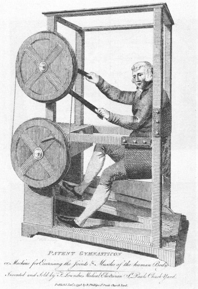
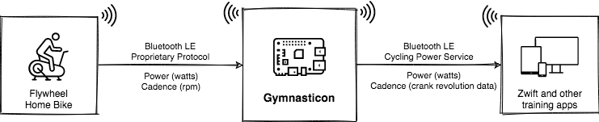

# Gymnasticon

<p align="center">

</p>

Gymnasticon enables the obsolete Flywheel Home Bike to work with Zwift and other training apps. Support for other bikes can be added easily.

The original Peloton Bike is now supported. Support requires a serial to USB adapter and custom wiring via RCA cables or through terminal blocks. For more details on setting up the hardware, see the [PR notes](https://github.com/ptx2/gymnasticon/pull/12). 

> Note: Peloton Bike+ is currently unsupported as it uses a USB-C connection and a (most likely) proprietary communications protocol.

<p align="center">

</p>

## Bikes tested

* Flywheel (tested)
* Peloton Bike (Original)
* LifeFitness IC5 (probably works)

## Apps tested

* Zwift
* TrainerRoad (only briefly)
* Rouvy (only briefly)

## Platforms tested

* Raspbian Buster on Raspberry Pi Zero W
* Raspbian Buster on Raspberry Pi 4
* macOS 10.13, 10.15 (see [#4](https://github.com/ptx2/gymnasticon/issues/4))

Note: If using a Bluetooth LE bike (e.g. Flywheel) a Bluetooth LE 4.1+ adapter with multi-role capability is required.

## Quick Start: Install Gymnasticon SD card image

<p align="center">

</p>

This is the easiest way to get up and running on a Raspberry Pi.

Prerequisites:

1. A Raspberry Pi Zero W or Raspberry Pi 4
2. A [compatible](https://www.raspberrypi.org/documentation/installation/sd-cards.md) micro-SD card (8GB+)
3. Access to a computer with an SD card slot
4. A program to write SD card images like [Raspberry Pi Imager](https://www.raspberrypi.org/downloads/) or `dd(1)`

Steps:

1. Download the latest [Gymnasticon SD card image](https://github.com/ptx2/gymnasticon/releases/latest/download/gymnasticon-raspberrypi.img.xz)
2. Write the image to the SD card using Raspberry Pi Imager or `dd`
3. Insert the SD card in the Raspberry Pi, power it up and wait a minute
4. Start pedaling and Gymnasticon should appear in the Zwift device list

Optional extra steps:

1. Setup [networking and remote access](https://www.raspberrypi.org/documentation/configuration/wireless/headless.md) so you can check logs, perform upgrades, and do clean shutdowns, etc.

> Note: It's easiest to leave the Raspberry Pi plugged in once it's set up. Safely shutting it down requires first logging in and halting the system at the command-line with `sudo halt`.

## Manual install

Try the Quick Start first. Otherwise read on for how to install Gymnasticon and its dependencies manually.

Dependencies:

* Node.JS 12.16.1+
  * [armv6l](https://unofficial-builds.nodejs.org/download/release/v12.18.3/) binaries (Raspberry Pi)
  * [x64](https://nodejs.org/dist/latest-v12.x/) binaries

* On Linux (including Raspberry Pi)
  * `sudo apt-get install libudev-dev` (required by node-bluetooth-hci-socket)

> Note: Your user must have permission to access the Bluetooth adapter and advertise services.

Install:

    npm install -g gymnasticon
    gymnasticon

To run as an unprivileged user:

    # this gives cap_net_raw+eip to all node programs not just gymnasticon
    sudo setcap cap_net_raw+eip $(eval readlink -f $(which node))

To run at boot time, restart on exit and to avoid giving cap_net_raw+eip to the node binary it is recommended to run under systemd. See the `deploy/gymnasticon.service` from this repository for an example systemd unit file.

    sudo cp gymnasticon.service /etc/systemd/system
    sudo systemctl enable gymnasticon
    sudo systemctl start gymnasticon

To view the output of Gymnasticon running under systemd:

    journalctl -u gymnasticon -f

## CLI options

```text
$ gymnasticon --help
```

```text
   __o
 _ \<_
(_)/(_)

Gymnasticon
v1.2.0

usage: gymnasticon [OPTIONS]

Options:
  --config                <filename> load options from json file        [string]
  --bike                  <type>
        [string] [choices: "flywheel", "peloton", "bot", "autodetect"] [default:
                                                                   "autodetect"]
  --bike-connect-timeout  <seconds>                        [number] [default: 0]
  --bike-receive-timeout  <seconds>                        [number] [default: 4]
  --bike-adapter          <name> for bike connection           [default: "hci0"]
  --flywheel-address      <macaddr>
  --flywheel-name         <name>
  --peloton-path          <path> usb serial device path
                                              [string] [default: "/dev/ttyUSB0"]
  --peloton-receive-trigger <value> behaviour when receiving data: event or poll
                                              [string] [default: event]
  --bot-power             <watts> initial bot power                     [number]
  --bot-cadence           <rpm> initial bot cadence                     [number]
  --bot-host              <host> for power/cadence control over udp     [string]
  --bot-port              <port> for power/cadence control over udp     [number]
  --server-adapter        <name> for app connection            [default: "hci0"]
  --server-name           <name> used for Bluetooth advertisement
                                                        [default: "Gymnasticon"]
  --server-ping-interval  <seconds> ping app when user not pedaling
                                                           [number] [default: 1]
  --ant-device-id         <id> ANT+ device id for bike power broadcast
                                                       [number] [default: 11234]
  --power-scale           <value> scale watts by this multiplier
                                                           [number] [default: 1]
  --power-offset          <value> add this value to watts  [number] [default: 0]
  --version               Show version number                          [boolean]
  -h, --help              Show help                                    [boolean]
```

## Contributing

    git clone https://github.com/ptx2/gymnasticon.git
    cd gymnasticon
    npm link

## HOWTO: Add support for a bike

It should be trivial to add support for other proprietary bikes, so long as
there is a means of getting realtime-ish cadence/power data from them.

1. Implement a bikeclient in src/bikes
2. Add cli options to src/app/cli-options
3. Add function to instantiate the bikeclient with the cli options to src/bikes/index.js

## License

MIT

## More info

Read the development notes [here](https://ptx2.net/posts/unbricking-a-bike-with-a-raspberry-pi).
